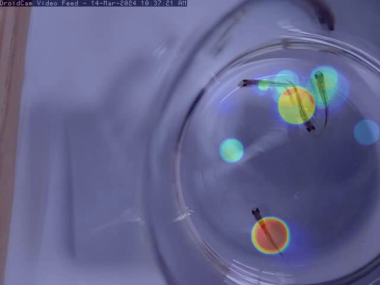
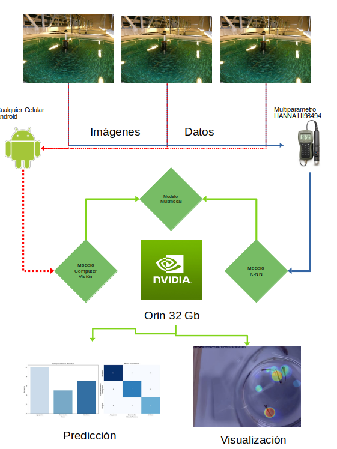
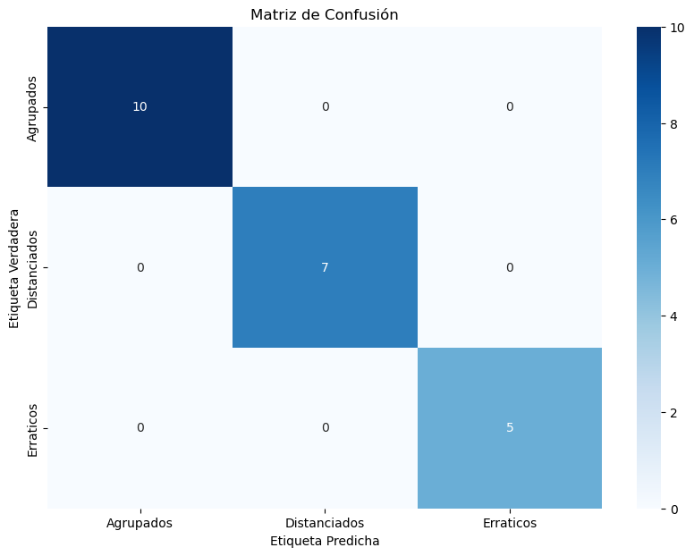
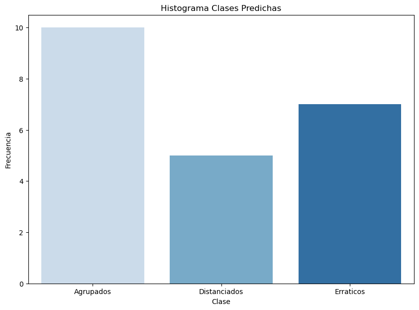

# Sistema de Comportamiento de Alevines V1
* el sistema se basa en el modelo de visualizacion computacional YOLOv8 y en Multimodal Deep Learning
* 🚀DTS(https://www.dts.cl/) | 👨LinkedIN(https://www.linkedin.com/in/renzo-valencia/) | 🐟Aquasur(https://www.aqua-sur.cl/)

  #  Objetivo
   *  🔶 Demostrar capacidad de desarrollo del area de inteligencia artificial en DTS.
   *  🔶 Realizar prueba de concepto de un sistema de inteligencia artificial para salmonicultura.
   *  🔶 Presentar un prototipo de baja resolucion para predecir comportamientos en peces.

  # Introduccion
    Este proyecto tiene como objetivo desarrollar un sistema de inteligencia artificial capaz de monitorear y predecir el crecimiento y la salud de los salmones en piscifactorías. Utilizaremos técnicas de visión por computadora, procesamiento de imágenes, y aprendizaje automático para lograr esto.

  

  

    
  

  # Resumen
  Para este proyecto se realizo un sistema que utiliza 3 tipos de herramientas de inteligencia artificial:
  
  *  🔥 Modelo de Visualizacion computacional YOLOv8 (https://docs.ultralytics.com/es)
  *  🔥 Modelo de procesamiento de informacion ML de tipo K-NN (https://scikit-learn.org/stable/)
  *  🔥 Modelo de procesamiento de data estructurada y sin estructura tipo Multimodal (https://paperswithcode.com/)

  Para el entrenamiento de este modelo se realizo una base de datos pequeña de aproximadamente 500 imagenes de alevines de tipo _Salmo Salar_ expuestos a ambientes de diversos tipos en un vaso ppt de 1 litro, posteriormente a la obtencion de las imagenes se realizo un etiquetado utilizando CVAT (https://www.cvat.ai/) para demarcar regiones de interes. El entrenamiento del sistema de visualizacion computacional se realizo utilizando la metodologia descrita por (https://docs.ultralytics.com/modes/train/) en formacion de Multi-GPU. Posterior al entrenamiento y prueba del modelo de tipo CV se realizo el rescate y procesamiento de la informacion utilizando la informacion ROI (Region of Interest) y el tracking para entrenar un modelo basico de tipo K-NN (https://es.wikipedia.org/wiki/K_vecinos_m%C3%A1s_pr%C3%B3ximos) de vecinos cercanos para estimar distancias de centroides geometricas de los peces analizados. Despues de realizar todo este analisis se utilizo la tecnica de arquitecturas tipo Multimodal Deep Learning para entrecruzar la informacion obtenida por las imagenes de los alevines, la informacion de ubicacion de los sujetos y data proporcionada por un multiparametro HANNA modelo HI98494/10 para realizar pronosticos de comportamientos basicos de los alevines. 

  # Esquema de Funcionamiento de sistema de monitoreo

  

  

    
  

*    ☎️ Celular Samsung S22 con sistema Android 13.
*    💻 Nvidia Orin de 32 Gb con arquitectura Ampere.
*    💻 (Desarrollo) Nvidia DGX (Opcional), puede ser cualquier equipo computacional.
*    💾 Equipo Multiparametrico Hanna HI98494.
  
  # Resultados del Sistema

  

    
  

  

    
  

*  👻  Los resultados preliminares del sistema de prediccion muestran que gran aprte de los peces a T° entre 12 a 16 grados celcius muestras un comportamiento erratico leve.
*  👻  Si bien el modelo tiene una alta taza de precision _87.8%_ y una sencibilidad de _90.5%_ solo se utiliza para ser un sistema demostrativo de herramientas de inteligencia artificial y por ningun motivo se recomienda su uso en produccion.

  # Contacto
  *  Para saber mas sobre esta maqueta u otras consultas sobre nuestros productos y servicios porfavor los invitamos a contactarse al correo info@dts.cl o llamar a +56 2 2397 1346.
